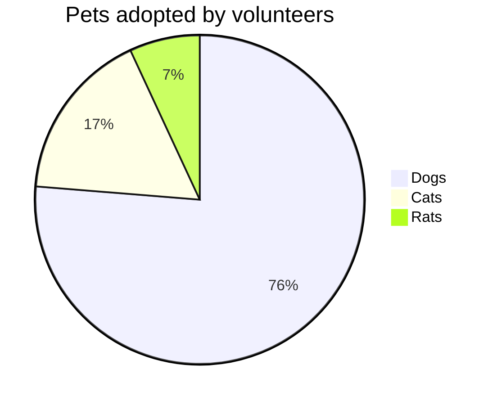

## Welcome to gamedevs

### Week 3

We did some difficulty assessments.
But not for the game :^)

| Semester      | Use Case      | Time Spend in h | Story Points |
| ------------- | ------------- | -------------   | ------------- |
| 3 | Player Movement           | 5 | 2 |
| 3 | World Interaction         | 10 | 5 |
| 3 | NPC Movement              | 8 | 3 |
| 3 | NPC Interaction           | 17 | 8 |
| 4 | Character Progression     | 21 | 8 |
| 4 | Generating NPC            | 20 | 8 |
| 4 | Accepting Quests          | 19 | 8 |

As you can see from our table, this semester will be quite challenging.
We noticed last semester that even though we rated the UCs as rather simple, we still had to invest a lot of time into them.
For this semester we plan a bit more pessimistic and assume that most of the coming UCs will demand plenty more time.

<script "https://cdnjs.cloudflare.com/ajax/libs/mermaid/9.0.1/mermaid.core.js">

- [back](https://albgei.github.io/gamedevs/index)

<script src="https://utteranc.es/client.js"
        repo="albgei/gamedevs"
        issue-term="pathname"
        label="commentary_"
        theme="github-dark"
        crossorigin="anonymous"
        async>
